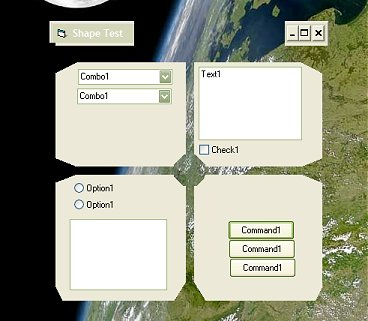



## HolePunch Transparency Control

### Description

Just a little fun with regions. Pop this control on your form, set the shape you want and, at run-time, you will have form transparency where your control is sited and in the shape that you selected. Yeah, I know the screenshot and test project are cheesy but I just didn't have time to make something more elaborate. The goal for me was simply to learn more about regions. Perhaps, those of you with the luxury of time can combine the shapes to make something more interesting or extend the control with more shapes and, maybe, a custom shape method. Just extract where you want and launch the HolePunchGroup.vbg...
 
### More Info
 

             |
---                |---
**Submitted On**   |2004-10-23 12:19:46
**By**             |[AlT](https://github.com/Planet-Source-Code/PSCIndex/blob/master/ByAuthor/alt.md)
**Level**          |Intermediate
**User Rating**    |5.0 (30 globes from 6 users)
**Compatibility**  |VB 6\.0
**Category**       |[Custom Controls/ Forms/  Menus](https://github.com/Planet-Source-Code/PSCIndex/blob/master/ByCategory/custom-controls-forms-menus__1-4.md)
**World**          |[Visual Basic](https://github.com/Planet-Source-Code/PSCIndex/blob/master/ByWorld/visual-basic.md)
**Archive File**   |[HolePunch\_18093210232004\.zip](https://github.com/Planet-Source-Code/alt-holepunch-transparency-control__1-56825/archive/master.zip)

### API Declarations

Mainly region and shape API.

